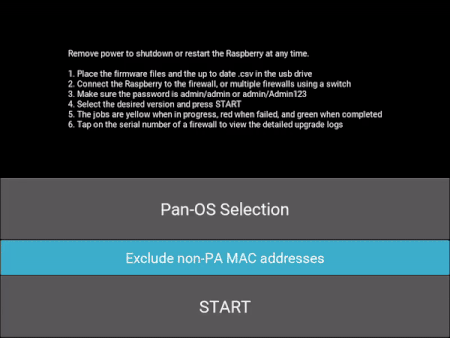
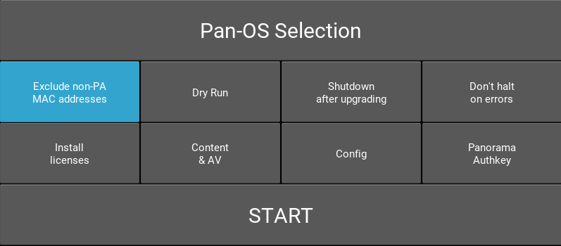

# paloversion-gui

  
*Dislaimer: actual upgrades may take longer :)*  
&nbsp;
&nbsp;
&nbsp;
&nbsp;
### Details

This script provides a graphical interface for the [paloversion](https://github.com/o5edaxi/paloversion) script running in batch mode.

### Requirements

* The device running the script must be connected to the same broadcast domain as the firewall's MGMT port.
* The script is intended to upgrade firewalls with factory settings. To use a custom password, modify the **BACKUP_PASSWORD** variable inside paloversion.sh

### New in v1.4



New features are available in the GUI, such as:

* Config file upload (requires [paloversion v1.4](https://github.com/o5edaxi/paloversion/releases/tag/v1.4.2) or above): to upload configs after upgrades, copy the files into the USB with filename **$SERIAL_NUMBER-config.xml**, e.g. "01234567890-config.xml"
* License file upload (requires [paloversion v1.4](https://github.com/o5edaxi/paloversion/releases/tag/v1.4.2) or above): to activate licenses after upgrades, copy the license files into the USB with filename **$SERIAL_NUMBER-$LICENSE.key**, e.g. "01234567890-support.key"
* Threat/AV install (requires [paloversion v1.4](https://github.com/o5edaxi/paloversion/releases/tag/v1.4.2) or above): to install Content and Antivirus packages, place the files into the USB drive with their original filenames (the first matching file will be installed for both Threats and then AV)
* Panorama authkey (requires [paloversion v1.4](https://github.com/o5edaxi/paloversion/releases/tag/v1.4.2) or above): to set a Panorama authkey on the firewalls, paste it into a file named "authkey.txt" and copy the file to the USB drive
* Shutdown after completion
* Dry runs

### Installation on Raspberri Pi + Touch Display

The following steps will setup a Raspberry to run the script at boot and load the firmware from a USB stick. A single 3B+ model is enough to upgrade 20+ firewalls per batch fairly quickly.

1. Install Raspbian: https://www.raspberrypi.org/documentation/computers/getting-started.html
2. Update packages and then install **cURL**, **iproute2**, and **xmlstarlet**
3. Install Kivy as explained in https://kivy.org/doc/stable/installation/installation-rpi.html:
    
    a. Essentially, install the dependencies listed here: https://kivy.org/doc/stable/installation/installation-rpi.html#install-source-rpi
    
    b. Then install Kivy: **pip3 install kivy[base,media]**
    
    c. Also, when using the official RPi touch display, add the following to the **[input]** section of **/home/pi/.kivi/config.ini** (remove the "mtdev" line if you notice difficulties navigating the touch menus in the script):
    
```
mouse = mouse
mtdev_%(name)s = probesysfs,provider=mtdev
hid_%(name)s = probesysfs,provider=hidinput
```

5. Format the USB drive using FAT32. This will allow it to be read and written by the Raspberry as well as a Windows machine. The drive should have enough space to contain all the images needed for upgrades.
6. Place all firmware files, .csv files, and App/Threat packages in the USB drive
7. Place paloversion.sh and paloversion-gui.py in a folder on the Raspberry's SD card (for example /home/pi/Desktop) and ensure they are executable
8. Ensure the USB drive automounts **as read-only** and consistently under the same folder each time it is inserted:

    a. Disable pcmanfm automounting by opening a File Manager window, then selecting **>Edit>Preferences>Volume** and unchecking all boxes
    
    b. Install usbmount: **apt-get install usbmount**
    
    c. Add "ro" to the MOUNTOPTIONS in file **/etc/usbmount/usbmount.conf**
    
    d. Run **sudo systemctl edit systemd-udevd** and enter the following in the indicated empty space, then save, close, and reboot the Raspberry:
    
```
[Service]
PrivateMounts=no
```

8. (Optional) make your /boot partition read-only to decrease the chances that it might become corrupted when removing power to the Raspberry
9. To make the GUI start fullscreen after boot ("kiosk" style), create file **palo.desktop** under **/home/pi/.config/autostart/** with the following contents (make sure you insert the correct python and script locations):

```
[Desktop Entry]
Type=Application
Name=PaloUpgrade
Exec=/usr/bin/python3 /home/pi/Desktop/paloversion-gui.py
```

10. Adjust variables **FIRMWARE_PATH**, **SCRIPT_PATH**, **SCRIPT_ROOT** in paloversion-gui.py to match your folder structure
11. (Optional) set up networking and SSH access for your Raspberry, or use mouse + keyboard to manage it directly
12. Done! The script should now start up whenever the Raspberry boots. Simply connect the Raspberry to the MGMT port of a firewall, turn it on, and it will be automatically discovered.


### License

This project is licensed under the [MIT License](https://github.com/o5edaxi/paloversion-gui/blob/main/LICENSE).
